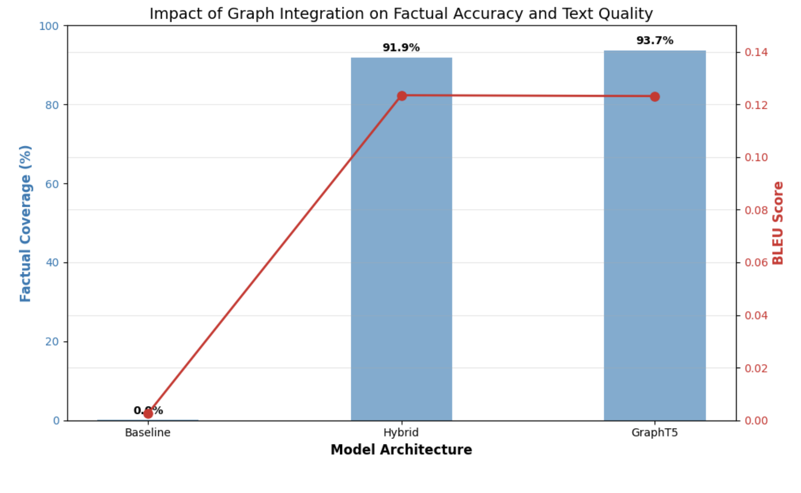

# Adapting-Language-Models-with-Graph-Information-for-Personalized-Text-Generation

Адаптация языковых моделей графовой информацией на примере генерации текста.


Этот проект исследует методы интеграции структурированных знаний из графов (Knowledge Graphs) в генеративные языковые модели. Интегрируя **графовые эмбеддинги (KGE)** в процесс генерации текста, метод решает проблему галлюцинаций в LLM и значительно повышает фактическую точность генерации в специфических доменах (в данном проекте - Новости/Политика, политические личности).

## Результаты

Интеграция графовой информации кардинально изменила способность модели генерировать достоверный текст. В то время как базовая модель (Standard T5) не смогла воспроизвести конкретные факты, обе графо-аугментированные архитектуры достигли **>90% фактического покрытия**.

### Визуализация метрик

На графике ниже представлено сравнение точности воспроизведения фактов (Factual Coverage) и качества текста (BLEU Score) для трех архитектур:


*(Влияние интеграции графа на фактическую точность и качество текста)*

### Сравнение Метрик (Количественный анализ)

| Архитектура | Factual Coverage (%) | BLEU Score | ROUGE-L | METEOR | Описание |
| :--- | :---: | :---: | :---: | :---: | :--- |
| **Baseline (T5-Small)** | `4.50%` | 0.0026 | 0.110 | - | Стандартная T5 без доступа к графу (Closed-book). |
| **Hybrid (Fusion)** | `91.89%` | **0.1235** | 0.322 | 0.298 | Late Fusion через внедрение в Cross-Attention. |
| **GraphT5 (Prefix)** | **93.69%** | 0.1232 | **0.327** | **0.301** | Early Fusion через префиксную настройку. |

### Качественный анализ (Примеры генерации)

Ниже приведены примеры того, как модели справляются с генерацией фактов. Baseline модель (без графа) часто выдает бессмысленный текст или галлюцинации, в то время как Hybrid модель успешно интегрирует факты из графа.

#### Пример 1: Roy Jenkins
**Факт из графа:** `member_of_political_party -> Labour Party`

*    **Baseline:** `H> Roy Jenkins R> member_of_political_party T> Labour Party T> Labour Party` *(Модель не смогла сформировать предложение и просто повторила структуру промпта)*
*    **Hybrid:** `He was a member of the Labour Party from 1994 to 2009.` *(Факт успешно интегрирован в связное предложение)*
*    **Reference:** `...he became one of the "Gang of Four", senior Labour figures who broke away from the party...`

#### Пример 2: Clement Attlee
**Факт из графа:** `holds_position -> Lord Privy Seal`

*    **Baseline:** `Texte from graph: H> Clement Attlee R> holds_position T> Lord Privy Seal`
*    **Hybrid:** `Clement Attlee was Lord Privy Seal of the United States from 1823 until his death in 1822.`
*   📖 **Reference:** `Attlee took Labour into the wartime coalition government in 1940 and served... initially as Lord Privy Seal...`

#### Пример 3: Franz Georg von Schönborn
**Факт из графа:** `born_in_year -> 1682`

*    **Baseline:** `H> Franz Georg von Schönborn R> born_in_year T> 1682`
*    **Hybrid:** `Franz Georg von Schönborn (August 16, 1682 – August 8, 1904) was an Austrian politician...` 
*    **Reference:** `Franz Georg von Schönborn (15 June 1682 – 18 January 1756) was a German nobleman...`

---

## Методология и Архитектура

Проект реализует пайплайн, который извлекает структурированные данные, кодирует их и использует для управления генерацией текста.

1.  **Сбор Данных:**
    *   **Источник:** Wikidata (SPARQL) и Wikipedia Summary.
    *   **Домен:** Политика и Бизнес (Сущности: Политики).
    *   **Формат:** Триплеты `(Субъект, Отношение, Объект)`.
2.  **Графовые Эмбеддинги:**
    *   **Алгоритм:** TransE (Translational Embedding).
    *   **Библиотека:** PyKEEN.
    *   **Размерность:** 64.
3.  **Стратегии Адаптации LM:**
    *   **GraphT5 (Prefix-Tuning):** Проецирует векторы TransE в размерность LLM и добавляет их перед входными токенами (Early Fusion).
    *   **Hybrid (Cross-Attention):** Внедряет графовые векторы в выход энкодера, позволяя декодеру явно обращаться к фактам через механизм внимания (Late Fusion).

## Рекомендации по внедрению

На основе проведенных экспериментов и анализа ошибок, сформулированы следующие рекомендации для практического применения:

### 1. Подготовка Данных
*   **Качество важнее количества:** Не подавайте весь граф знаний. Фильтруйте подграфы под конкретный домен (например, только `Политика`, `Заболевания`).
*   **Очистка:** Удаляйте технические свойства (ID, URL), так как они создают шум и снижают качество генерации.

### 2. Стратегия Внедрения (Embedding Strategy)
*   **Согласование размерностей:** Всегда используйте обучаемый линейный слой-проектор (`Linear Projector`), инициализированный методом Xavier, для перевода KGE (64-256 dim) в пространство LLM (768+ dim).
*   **Выбор архитектуры:**
    *   Для простых задач (краткая сводка) используйте **Prefix-Tuning** (быстрее учится).
    *   Для задач, требующих высокой точности, используйте **Hybrid Fusion**, так как он дает модели прямой доступ к фактам на каждом шаге декодирования.

### 3. Проблема OOV (Out-Of-Vocabulary)
*   Реализуйте гибридный вход: если у сущности нет предрасчитанного вектора (новая сущность), используйте **текстовое представление графа** (линеаризованные триплеты) как запасной вариант (fallback).

### 4. Методология Оценки
*   **Не полагайтесь только на BLEU:** Стандартные n-граммные метрики не отражают фактическую точность.
*   **Factual Coverage — must have:** Обязательно внедряйте проверку наличия объектов графа в сгенерированном тексте (через Regex или NER).

## Установка и Запуск

Клон репо и зависимости:

```bash
git clone https://github.com/Tsanami/Adapting-Language-Models-with-Graph-Information-for-Personalized-Text-Generation
cd graph-augmented-lm
pip install -r requirements.txt
```

### Примеры команд
```bash
python -m spacy download en_core_web_sm
```
1.  **Сбор данных:**
    ```bash
    python source/data_collection.py --limit 2000
    ```
2.  **Обучение эмбеддингов (TransE):**
    ```bash
    python source/train_kge.py --epochs 50 --dim 64
    ```
3.  **Обучение и Валидация Моделей:**
    ```bash
    python source/train_lm.py --model hybrid --epochs 10
    ```
4.  **Оценка качества:**
    ```bash
    python source/evaluate.py --model hybrid.pth
    ```

## Структура Проекта

```text
.
├── data/                  # Сырые и обработанные датасеты
├── source/
│   ├── data_collection.py # Скрипты для SPARQL и Wikipedia
│   ├── train_kge.py       # Обучение PyKEEN
│   ├── train_lm.py        # Цикл обучения T5 (Train/Val split)
│   ├── project_modules.py # Классы моделей (GraphAugmentedT5, HybridGraphT5)
│   └── evaluate.py        # Расчет метрик (BLEU, Coverage)
├── images/                # Графики и иллюстрации
├── notebooks/             # Jupyter notebooks с экспериментами
├── requirements.txt
└── README.md
```